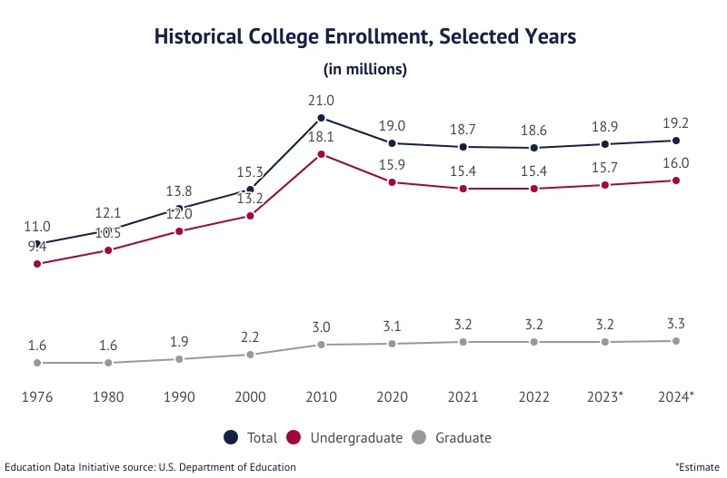

#READ ME

 ####################################################################################################################
### Test File: 
This is a file that was my original working file for trying to connect to a different HTML sources. My goal was to try to pull from a source that was consistent in placement or naming for each data point, so that I wouldn't need to hard code every element and location manually (at that point why wouldn't I just copy/paste the data). 

The test exercise file gives more thorough breakdowns of different avenue I went down (though it is mostly just code) 
- I first ran into an issue on U.S. News and World Reports pages (e.x. https://www.usnews.com/best-colleges/saint-louis-university-2506). USNWR was going to be my primary HTML source, however in my scraping attempts, I learned about dynamic HTML loading for sites. With the help of Claude I tried to code a few workarounds, mostly trying to install a background Chrome browser that would wait until the full page loaded then grab the element I desired. After installing different modules to help with this, I continued to run into other issues, including Databricks restrictions around browser automation. 

- I found another site that had the info I was looking for in a stardardized format was College Raptor, however I almost immediately ran into anti-box detection that stopped any hope of scraping the site in it's tracks. I checked the robots.txt file and found they did infact disallow all scraping. 

- As I mentioned earlier, I was hesitant to try to hard code scraping each element from the various About pages, especially since I was unsuccessful in even finding some of the enrollment numbers on a few schools. 

> #####Next Step
> - While inititally avoiding Wikipedia, I elected to move forward with the site as my primary source for the information I wanted to scrap in a standardized layout. My only hold up was that the date ranges didn't look *exactly* correct against what I could find on the sites, which some of the entries being past enrollment numbers (i.e. from 2023). I consulted some additional data sources to determine overall reliability of that older data for our purposes. Data from the College Enrollment Statics site (https://educationdata.org/college-enrollment-statistics) shows marginal growth over the last few years. With this in mind I made the assumpt that for the purposes of this assigned analytics ask, any descrepancy would be within an exceptable range of error. 
> 
>   

 ####################################################################################################################

### Main File: 
**NOTE:** I don't plan on rehashing all my code here as I feel I did a good job providing comments on each step throughout with some additional mark up cells. But I will go through general pipeline, where I could see potential complexity if I were to balloon this out (outlined in the Pipeline Notes Section), as well as my severe weather classification. 

> ####Pipeline
>     1. Import needed modules.
>     ↓
>     2. Hard code university list, headers dictionary, and an empty scraped data list. 
>     ↓
>     3. Scraping, cleaning and adding to established data list. 
>     ↓
>     4. Create a dataframe from the compiled data. 
>     ↓
>     5. Create API connection.
>     ↓
>     6. Create a JSON file through the data collected via API. 
>     ↓
>     7. Create a dataframe from the created JSON file.
>     ↓
>     8. Code a function to review each row of the weather data and determine if daily weather was "severe" or not. 
>     ↓
>     9. Run the new function and add a column to the existing weather dataframe. 
>     ↓
>     10. Count the number of "severe" weather days. 
>     ↓
>     11. Code a function to take the individual rows from the scraped dataframe and calculate the total number of students impaced by severe weather. 
>     ↓
>     12. Run the new function and add a column to the the existing scraped dataframe. 
>     ↓
>     13. Create a new dataframe named df_final to include the assignements required columns. 
> 
> > ##### Pipeline Notes (note the number corresponds to the step in the pipeline): 
>         2. I wanted to start with a hard coded list of sites and their university name so I could more easily set up some error checking along the way. 
>         3. I tried to do almost all my cleaning and parsing steps HERE since it was as upstream as possible. on another point, I actually extracted the coordinates as a separate column in the dataframe, my thought was that I might be able to use the coordinates in my API calls to get very ganular on the weather data. However, given all my schools are in the greater STL area, I decided not to go down that path, but the option is definitely there if I wanted to look multi-region. Though I think I would need to contend with fallback options for if the coordinates were null on Wikipedia as some of the entries I scraped are. 
>         8. I go more into my rationale for severe weather and the grading system in the next section of the READ ME, but as an addendum here, I did investigate bringing wind into the calculation equation as I believe that to be a strong factor in my classification, however bringing it in provded challenging as it wanted to import on an hourly time period instead of a daily average. This paired with an anecdotal that most days where it would have played a factor were already being marked severe by my classifications, I elected to omit wind data at this juncture. 
>         13. Following the outlined assignment, I specifically included the following columns: University Name, State, Number of students enrolled, number of days with severe weather, total student-days impacted. (An additional note here: for each row I included both the student days for the individual university as well as the full sum for the data frame incase only a few rows were queries from this later.)
        * GENERALLY I do think there are ways to optimize this code for real world use, however, I want to leave it mostly as I built it so my thought process could be more easily understood and the output of each code blcok could be checked easier. 

##### Weather Classification
> **Main criteria:** 
> 1. Average Daily Temp below 20 Degrees F. 
> 2. Minimum Temp below 15 Degrees F. 
> 3. Snowfall is more than 2 inches in a given day. 
> 4. Any day with more than .15 inch of precipitation while AVG Daily temp below freezing. 
> 
> ######Rational For Each Point: 
> 1. hypothermic conditions can rapidly set in below freezing. Given the 30-20 degrees F can be managed, teens and below can cause bad things to happen very quickly. 
> 2. Minimum temps often hit overnight/early morning. While people aren't typically out and about around times, it can cause other extreme or hazard issues for people either throughout their nights (i.e. burst pipes causing residence issues) or could cause morning automobile issues (which while they could be noticed before one might leave the house, could also cause stalls in transit that could lead to to a hazardous situation very quickly). 
> 3. Given anecdotal evidence around STL's response time to multiple inches of snow and general infrastructure barriers making even *cleared* snow block road lanes and sidewalks, there is conserable added hazard risks to even what could be considered "*easy*" travel. 
> 4. This ties a bit more with point 2, however it is more encompasing of what might happen throughout the full day with even **light** precipitation and low average temps rather than just the overnight low. 

######Classification Conclusion:
> These points were made both from my personal knowledge of hazardous conditions as well as by reviewing documentation from the National Weather Service: https://www.weather.gov/dlh/extremecold

###FINAL CONCLUSION: 
- I think this my work here demonstrates I can work with APIs and HTML for data ingestion. 
- I think I chose an acceptable and reusable table for both my final output as wel as my intermediary dataframes. 
- I think I correctly and reasonably used transformations to clean data and implement aggregations where needed. 
- I think I adequetely walked through my assumptions and reasonings. 
- I think my pipeline and created dataframes could be confidently reused by another analyst. 

**final general note:** I think this is boilerplate for this class, but I did rely on both Claude and the internal Databricks AI sources to help be get baseline code as well as troubleshoot issues I ran into. 